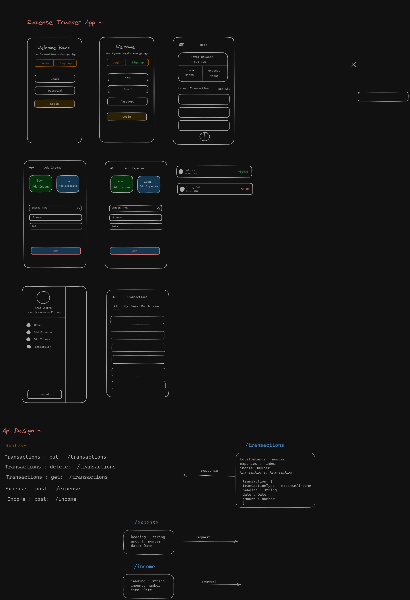

# Expense Tracker Mobile App

Developed a mobile app using React Native with Expo for tracking expenses. Implemented a Node.js and Express backend with MySQL for data storage, featuring secure token-based authentication and user-friendly UI for adding, editing, and categorizing expenses.
